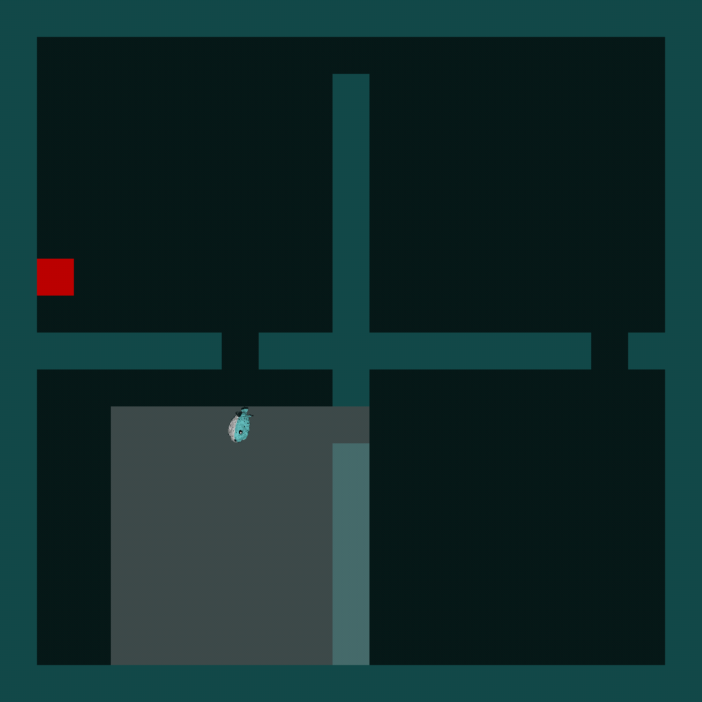

## Four Rooms (PufferLib Native)

High-performance native environment (MiniGrid-style FourRooms) implemented in C with a thin Python binding. Trains fast via PufferLib vectorization and supports live rendering.



### Features
- Native PufferLib env with zero-copy buffers
- MiniGrid-compatible task (7×7×3 egocentric obs, discrete actions)
- Adjustable map size (default 19)
- Built-in train and eval scripts

### Quickstart
```bash
# Create env
python -m venv .venv
source .venv/bin/activate

# Dependencies (PufferLib 3.0 requires numpy<2)
pip install -U pip setuptools wheel "numpy<2" torch pufferlib

# Build the native extension
python setup.py build_ext --inplace
```

Optional: enable on-screen rendering for eval (macOS)
```bash
brew install raylib
python setup.py build_ext --inplace
```

### Train
```bash
python train.py --config config/four_rooms.ini
```
Edit `config/four_rooms.ini` to adjust vectorization, env size, and PPO hyperparameters.

### Evaluate / Render
```bash
# Raylib window (recommended)
python eval.py --render-mode raylib --load latest

# Terminal preview (fallback)
python eval.py --render-mode ansi
```

### License
MIT